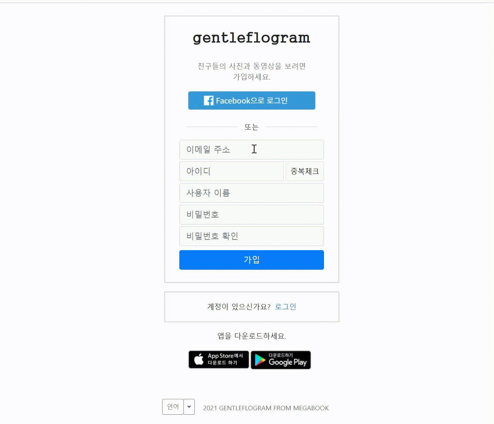

</a> 
</a>
</a>
</a>
</a> 
</a> 
</a>
</a> 
</a> 

# :notes: gentleflogram
### SNS copy 프로젝트

 ### :speech_balloon: 프로젝트 설명
 > 기본적인 CRUD 기능과 웹서비스에 대한 이해를 높히기 위해 대중적으로 사용되고 있는     
   instagram 서비스를 copy한 프로젝트          
   주요 기능은 글쓰기, 파일 업로드, 타임라인 뷰, 댓글 그리고 좋아요 기능이다.       
 ### :bar_chart: 설계 
  > <b>UI 기획</b>        
    https://ovenapp.io/project/pKWPrQGWn8N6xqePxNRgDwkeUREXAYZE#uMo9p  
    <b>Database, URL 설계</b>        
    https://docs.google.com/spreadsheets/d/1JfFpGoAmIT_b1x0R8pY1DKgtvnpsQI_TubDRBrcHhkM/edit#gid=0
  
### :movie_camera: 주요 기능 시연 데모    
  :one: 회원가입 / 로그인     
       
 
    

### :heavy_check_mark: 외부 라이브러리 라이센스
 > * Tomcat [Apache License 2.0](https://www.apache.org/licenses/LICENSE-2.0)   
 > * Mysql [GPLv2 or proprietary](https://www.gnu.org/licenses/gpl-3.0.html)   
 > * Spring framework [Apache License 2.0](https://www.apache.org/licenses/LICENSE-2.0)     
 > * Mybatis [Apache License 2.0](https://www.apache.org/licenses/LICENSE-2.0)    
 > * Bootstrap [MIT License](https://opensource.org/licenses/MIT)    
 > * jQuery [MIT License](https://opensource.org/licenses/MIT)             
  
       
 ### :memo: 향후 계획
 > * 보안 향상을 위해 spring security 구현    
 > * 스티커 클릭 취소 이벤트    
 > * 프로필 이미지 넣기 기능    
 > * 공개 비공개 관련 기능    
 > * preview 화면에 스티커 진행상황 보이기    
 > * 칭찬리스트 내용 수정 기능    
 > * 칭찬리스트 삭제 기능    
 > * 댓글 삭제 기능    
